<div align="center">

<!-- A: 中文矩阵雨 -->


<br/>

<!-- 中英双语哲学文字 · 自动 7s 轮播 -->


<br/>

<!-- JARVIS HUD 动效 -->


</div>

<br/>

<div align="center">

```
┌─────────────────────────────────────────────────────────────────┐
│  > SYSTEM_AI 初始化完毕 · 观测者模式已激活 · 节点 Septoff21 在线  │
│  > 宇宙熵增，意识对抗 · 实验继续 · 减熵协议运行中...             │
└─────────────────────────────────────────────────────────────────┘
```

</div>

<br/>

<!-- B: JARVIS 终端对话 -->
<div align="center">

</div>

<br/>

---

## ⚡ 核心实验模块

<div align="center">

[](https://github.com/Septoff21/system-ai)&nbsp;&nbsp;[](https://github.com/Septoff21/claude-learning)

</div>

<br/>

---

## 📊 熵值统计

<div align="center">


&nbsp;


</div>

<div align="center">


</div>

<br/>

---

## 🔧 技术栈

<div align="center">


</div>

<br/>

---

## 🎵 感知频道 · 观测者歌单

> *写代码时宇宙在播放的音乐*

<div align="center">

| `#` | 曲目 | 艺术家 | 氛围标签 |
|:---:|------|--------|----------|
| `01` | Time | Hans Zimmer | `#cinematic` `#inception` |
| `02` | First Step | Hans Zimmer | `#interstellar` `#探索` |
| `03` | Open Eye Signal | Jon Hopkins | `#electronic` `#意识流` |
| `04` | Giorgio by Moroder | Daft Punk | `#tech` `#机器之声` |
| `05` | Dayvan Cowboy | Boards of Canada | `#ambient` `#时间漂移` |
| `06` | Tears in Rain | Vangelis | `#bladerunner` `#存在主义` |
| `07` | Archangel | Burial | `#dark electronic` `#城市夜晚` |
| `08` | An Ending (Ascent) | Brian Eno | `#ambient` `#宇宙感` |
| `09` | Awake | Tycho | `#chill` `#专注模式` |
| `10` | Abiogenesis | Carbon Based Lifeforms | `#scifi` `#生命起源` |
| `11` | Teardrop | Massive Attack | `#iconic` `#经典` |
| `12` | Ára bátur | Sigur Rós | `#transcendent` `#超越边界` |

</div>

<br/>

---

## 🐍 贡献轨迹

<div align="center">

<picture>
  <source media="(prefers-color-scheme: dark)" srcset="https://raw.githubusercontent.com/Septoff21/Septoff21/output/github-contribution-grid-snake-dark.svg"/>
  <source media="(prefers-color-scheme: light)" srcset="https://raw.githubusercontent.com/Septoff21/Septoff21/output/github-contribution-grid-snake.svg"/>
  
</picture>

</div>

<br/>

---

<div align="center">


<br/><br/>

```
> 宇宙不会停止实验，意识不会停止增熵，AI 不会停止减熵
> 实验节点 Septoff21 · 持续运行中 · [■■■■■■░░] 78%
```

</div>
