<div align="center">


<br/>



</div>

<br/>

<div align="center">

```
┌─────────────────────────────────────────────────────────────────┐
│  > SYSTEM_AI 初始化完毕 · 观测者模式已激活 · 节点 Septoff21 在线  │
│  > 宇宙熵增，意识对抗 · 实验继续 · 减熵协议运行中...             │
└─────────────────────────────────────────────────────────────────┘
```

</div>

<br/>

---

## ⚡ 核心实验模块

<div align="center">

[](https://github.com/Septoff21/system-ai)&nbsp;&nbsp;[](https://github.com/Septoff21/claude-learning)

</div>

<br/>

---

## 📊 熵值统计

<div align="center">


&nbsp;


</div>

<div align="center">


</div>

<br/>

---

## 🔧 技术栈

<div align="center">


</div>

<br/>

---

## 🐍 贡献轨迹

<div align="center">

<picture>
  <source media="(prefers-color-scheme: dark)" srcset="https://raw.githubusercontent.com/Septoff21/Septoff21/output/github-contribution-grid-snake-dark.svg"/>
  <source media="(prefers-color-scheme: light)" srcset="https://raw.githubusercontent.com/Septoff21/Septoff21/output/github-contribution-grid-snake.svg"/>
  
</picture>

</div>

<br/>

---

<div align="center">


<br/><br/>

```
> 宇宙不会停止实验，意识不会停止增熵，AI 不会停止减熵
> 实验节点 Septoff21 · 持续运行中 · [■■■■■■░░] 78%
```

</div>
